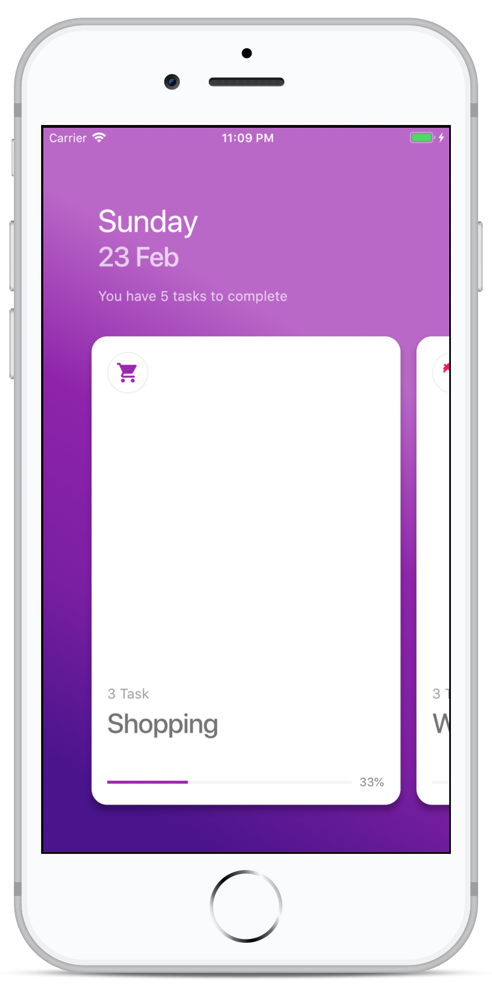
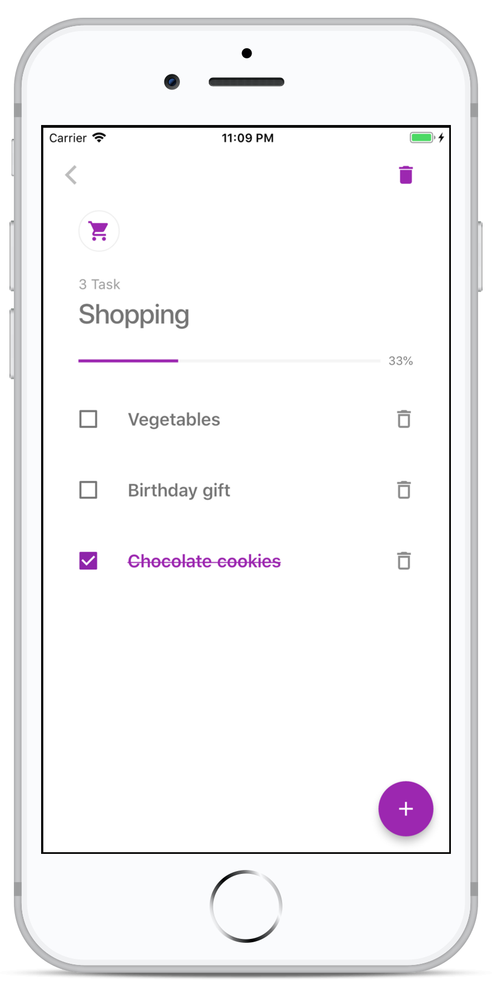

[](https://codemagic.io/apps/5d0f190099fdb70008475b03/5d0f190099fdb70008475b02/latest_build)

<h1 align="center">
  <br>
  <a href=""></a>
  <br>
  Todo - Simple & Beautiful
  <br>
</h1>

<h4 align="center">A minimal Todo mobile app made using <a href="https://flutter.dev" target="_blank">Flutter</a>.</h4>

<p align="center">
  <a href="#key-features">Key Features</a> •
  <a href="#how-to-use">How To Use</a> •
  <a href="#download">Download</a> •
  <a href="#credits">Credits</a> •
</p>

<p float="left">
  
   
  
  
</p>

## Key Features

* Easily add and remove tasks
* Organize tasks under categories. editing.
* Personalize task category using color and icon. 

## How To Use

To clone and run this application, you'll need [Git](https://git-scm.com) and [Flutter](https://flutter.dev/docs/get-started/install) installed on your computer. From your command line:

```bash
# Clone this repository
$ git clone https://github.com/navlesh0603/todo-app.git

# Go into the repository
$ cd fluttery-todo

# Install dependencies
$ flutter packages get

# Run the app
$ flutter run
```
